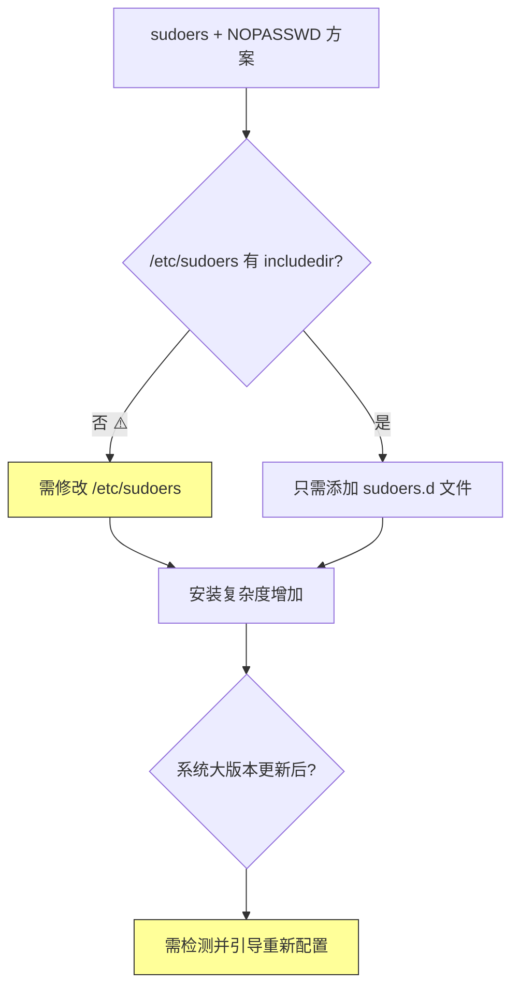
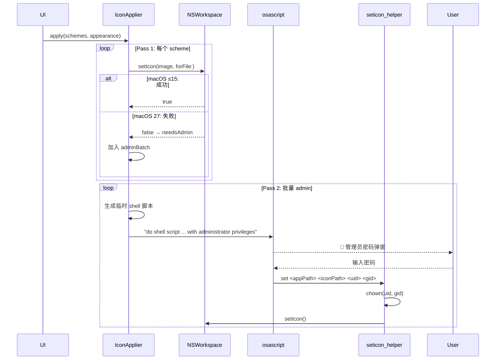
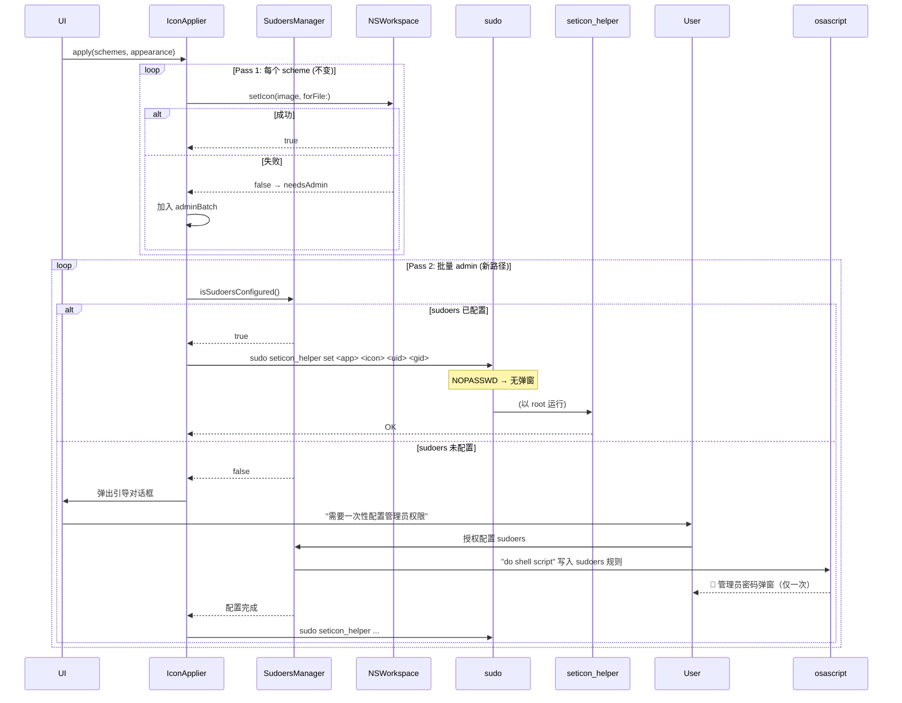
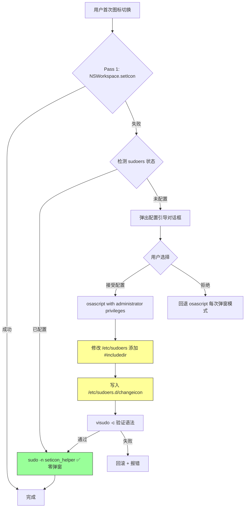
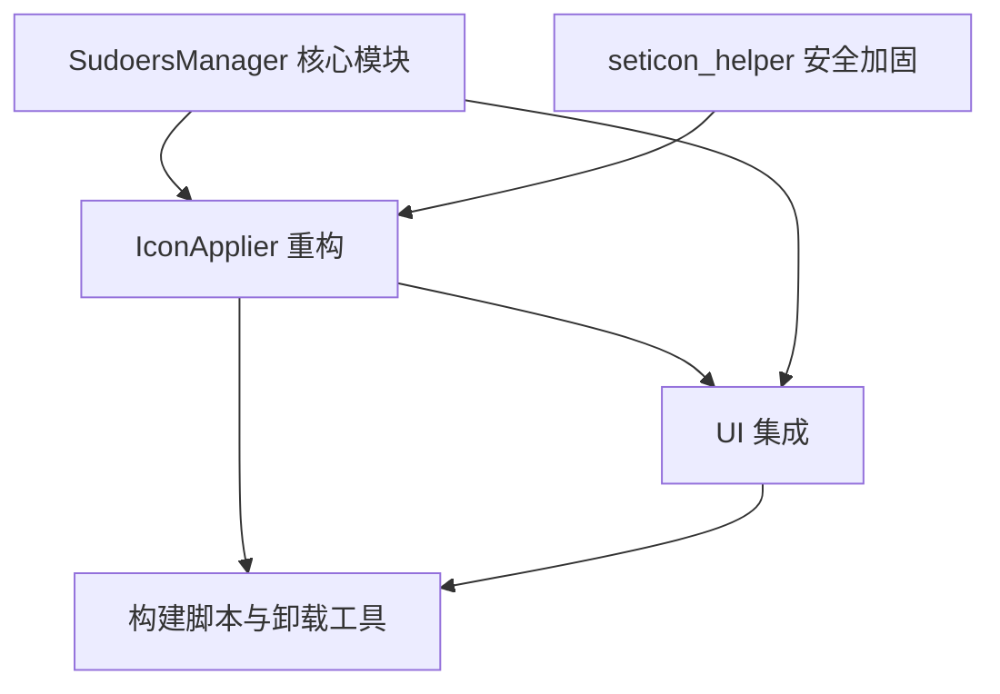
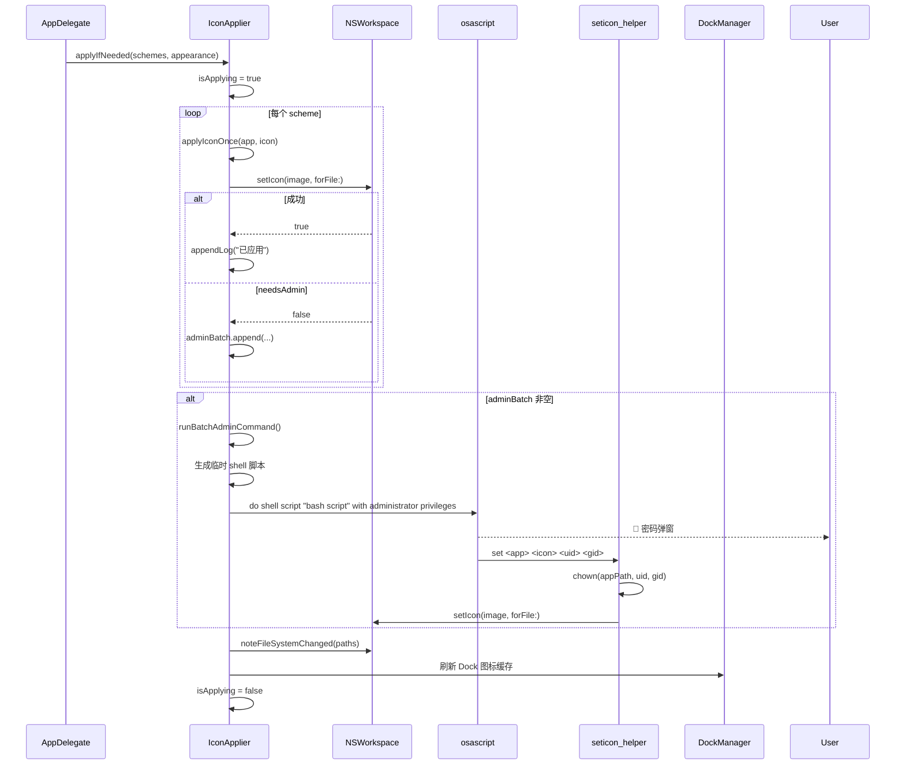

# sudoers + NOPASSWD 方案全面技术评估

> **评估对象**: ChangeIcon macOS 原生应用
> **评估日期**: 2025-06-17
> **目标系统**: macOS 27 beta (Build 26A5353q)
> **评估范围**: 使用 `/etc/sudoers.d/changeicon` 免密码 sudo 方案替代当前 `osascript with administrator privileges` 路径

---

## 目录

1. [技术可行性评估](#1-技术可行性评估)
2. [架构设计方案](#2-架构设计方案)
3. [安全风险评估](#3-安全风险评估)
4. [实现任务列表](#4-实现任务列表)
5. [待明确问题清单](#5-待明确问题清单)

---

## 1. 技术可行性评估

### 1.1 `sudo` 在 macOS 27 GUI 进程中能否正常工作

**当前环境实测结果**:

| 检测项 | 结果 |
|--------|------|
| macOS 版本 | 27.0 (Build 26A5353q) |
| SIP 状态 | **已启用** |
| sudo 版本 | 1.9.17p2 |
| `/etc/sudoers.d/` 目录 | 存在（空目录，drwxr-xr-x root:wheel） |
| `/etc/sudoers` 中 `#includedir` | **❌ 默认不存在** |

**结论**: `sudo` 二进制本身在 macOS 27 上正常工作。关键障碍在于：**默认 `/etc/sudoers` 没有 `#includedir /etc/sudoers.d` 指令**，这意味着仅仅向 `/etc/sudoers.d/` 添加文件是不够的。

**TCC 拦截分析**:
- ChangeIcon 当前使用 ad-hoc 签名，未启用 App Sandbox
- `Process.run()` 调用 `/usr/bin/sudo` 时，sudo 自身会通过 PAM (`pam_opendirectory`) 进行认证——这**不是** TCC 路径
- 配置 `NOPASSWD` 后，sudo 跳过密码提示，PAM 也不需要 GUI 弹窗
- macOS 27 新增的写入保护主要针对 `/Applications/` 下的文件系统操作，不拦截 `sudo` 进程启动

**结论**: `sudo` 在 GUI 进程中通过 `Process.run()` 调用是可行的。TCC 不拦截 `sudo` 本身的执行。

### 1.2 `/etc/sudoers.d/` 在 macOS 上是否标准支持

**关键发现**: macOS 27 的默认 `/etc/sudoers` **不包含** `#includedir /etc/sudoers.d`。

验证方式（无法直接读取 `/etc/sudoers`，但通过以下方式推断）:
```bash
$ ls -la /etc/sudoers.d/    # 存在但为空
$ grep includedir /etc/sudoers  # 无结果（需要 root 权限才能确认）
```

这是经典 macOS 行为：Apple 创建了 `/etc/sudoers.d/` 目录作为约定，但**默认不激活**。这与 Linux 发行版（如 Ubuntu）不同，后者默认就有 `#includedir /etc/sudoers.d`。

**对方案的影响**: 安装流程需要多一步——**修改 `/etc/sudoers` 本身**，添加 include 指令。这增加了复杂度和风险。

### 1.3 系统更新是否可能清空 sudoers.d

| 场景 | `/etc/sudoers` | `/etc/sudoers.d/` |
|------|---------------|-------------------|
| macOS 小版本更新 (27.0 → 27.1) | 通常保留 | 通常保留 |
| macOS 大版本升级 (26 → 27) | **可能重置为默认** | **目录保留，文件可能保留** |
| macOS 全新安装 / 迁移 | 重置为默认 | 目录存在但为空 |

**风险等级**: 中等。大版本升级后 `/etc/sudoers` 可能被重置，`#includedir` 指令丢失，但 `/etc/sudoers.d/changeicon` 文件本身大概率保留。应用程序需要检测这种状态并引导用户重新配置。

### 1.4 ad-hoc 签名的二进制文件能否被 sudo 执行

**可以**。`sudo` 不强制执行代码签名要求。它只检查:
1. 文件是否可执行（`+x` 权限位）
2. 调用者是否在 sudoers 中有权限

ad-hoc 签名（`codesign --force --sign -`）足以满足 sudo 的执行要求。当前 `build_app.sh` 已经对 seticon 做了 ad-hoc 签名。

### 1.5 可行性总结



**总体评估**: ✅ **技术上可行**，但需解决 `/etc/sudoers` 默认不包含 `#includedir` 的问题。

---

## 2. 架构设计方案

### 2.1 当前架构回顾



### 2.2 新架构设计

核心思路：将 `runBatchAdminCommand()` 的 `osascript` 路径替换为 `sudo seticon_helper`，在首次使用时引导用户配置 sudoers。



### 2.3 新增 SudoersManager 模块

```swift
/// 管理 /etc/sudoers.d/changeicon 的安装、检测、清理
@MainActor
final class SudoersManager: ObservableObject {
    @Published var isConfigured = false
    
    /// sudoers 规则文件的固定路径
    static let sudoersFilePath = "/etc/sudoers.d/changeicon"
    
    /// 检测当前 sudoers 是否已配置
    /// 通过执行 `sudo -n true` 来验证（不出现在 sudo 日志中，安全且准确）
    func checkConfiguration() async -> Bool
    
    /// 安装 sudoers 规则（首次配置，需要管理员密码弹窗一次）
    /// 使用 osascript with administrator privileges 来获得写入权限
    func install() async throws
    
    /// 卸载 sudoers 规则
    func uninstall() async throws
    
    /// 验证规则文件内容是否匹配当前 helper 路径
    func validateRuleContent() -> Bool
}
```

### 2.4 修改 `IconApplier.runBatchAdminCommand()`

```swift
private func runBatchAdminCommand(_ items: [(app: String, icon: String, name: String)]) async throws {
    guard let helper = bundleHelperPath() else {
        throw IconError.needsAdmin("辅助工具未嵌入")
    }
    
    let uid = getuid()
    let gid = getgid()
    
    // ── 新路径：尝试 sudo with NOPASSWD ──
    let sudoersOK = await SudoersManager.shared.checkConfiguration()
    
    if sudoersOK {
        // 零弹窗路径
        for item in items {
            try await runSudoHelper(helper: helper, app: item.app, icon: item.icon, uid: uid, gid: gid)
        }
        return
    }
    
    // ── 降级路径 1：引导用户配置 sudoers ──
    // 弹出一次性配置对话框
    let userAccepted = await showSudoersSetupPrompt(items: items)
    if userAccepted {
        try await SudoersManager.shared.install()
        for item in items {
            try await runSudoHelper(helper: helper, app: item.app, icon: item.icon, uid: uid, gid: gid)
        }
        return
    }
    
    // ── 降级路径 2：回退到 osascript 弹窗（保持兼容） ──
    try await runBatchViaOsascript(items)
}

/// 通过 sudo 执行单个 helper 调用
private func runSudoHelper(helper: String, app: String, icon: String, uid: uid_t, gid: gid_t) async throws {
    try await withCheckedThrowingContinuation { (cont: CheckedContinuation<Void, Error>) in
        let p = Process()
        p.executableURL = URL(fileURLWithPath: "/usr/bin/sudo")
        p.arguments = ["-n", helper, "set", app, icon, "\(uid)", "\(gid)"]
        // -n: non-interactive，不弹密码提示
        
        let err = Pipe()
        p.standardError = err
        p.terminationHandler = { proc in
            if proc.terminationStatus == 0 {
                cont.resume()
            } else {
                let e = String(data: err.fileHandleForReading.readDataToEndOfFile(), encoding: .utf8) ?? ""
                cont.resume(throwing: IconError.needsAdmin("sudo 执行失败: \(e)"))
            }
        }
        do { try p.run() } catch {
            cont.resume(throwing: IconError.needsAdmin("无法启动 sudo"))
        }
    }
}
```

### 2.5 sudoers 文件内容设计

```bash
# /etc/sudoers.d/changeicon
# Managed by ChangeIcon — do not edit manually
# Allows passwordless execution of seticon_helper for app icon switching

<username> ALL=(root) NOPASSWD: /Applications/ChangeIcon.app/Contents/MacOS/seticon set *, /Applications/ChangeIcon.app/Contents/MacOS/seticon remove *
```

**关键安全约束**:
- 路径锁定到 `ChangeIcon.app` bundle 内的具体路径
- 命令限定为 `set` 和 `remove` 两个子命令
- 参数使用通配符 `*`，但 helper 内部会验证参数有效性

### 2.6 安装流程



### 2.7 判断逻辑：sudo 路径 vs osascript 回退

```swift
enum AdminStrategy {
    case sudoNopasswd     // sudo -n → 零弹窗
    case sudoersGuide     // 引导用户一次性配置 sudoers
    case osascriptFallback // 每次弹窗（当前行为，保留兼容）
}

func selectStrategy() async -> AdminStrategy {
    // 1. 先检测 sudoers 是否已配置
    if await SudoersManager.shared.checkConfiguration() {
        return .sudoNopasswd
    }
    
    // 2. 检查是否曾拒绝过配置（UserDefaults 记录）
    if UserDefaults.standard.bool(forKey: "sudoers_setup_rejected") {
        return .osascriptFallback
    }
    
    // 3. 首次 → 引导配置
    return .sudoersGuide
}
```

### 2.8 错误处理与清理

| 场景 | 处理策略 |
|------|----------|
| sudoers 规则被手动删除 | `sudo -n` 返回非零 → 降级到 osascript 并提示重新配置 |
| seticon_helper 路径变更（App 更新） | `validateRuleContent()` 检测不一致 → 自动更新规则 |
| 系统更新重置 /etc/sudoers | `#includedir` 丢失 → 引导重新配置 |
| visudo 语法检查失败 | 删除已写入的规则文件，回滚，报错 |
| 用户卸载应用 | 提供「清理 sudoers 规则」按钮或脚本 |

---

## 3. 安全风险评估

### 3.1 攻击面分析

#### 威胁模型

| 威胁 | 风险等级 | 缓解措施 |
|------|---------|----------|
| **路径劫持**: 攻击者替换 `ChangeIcon.app/Contents/MacOS/seticon` | 🔴 高 | 路径锁定在 sudoers 规则中 + helper 只接受绝对路径参数 |
| **参数注入**: 通过构造恶意文件名注入 shell 命令 | 🟡 中 | `Process.run()` 使用参数数组，不经过 shell；helper 内部用 `CommandLine.arguments` |
| **TOCTOU (Time-of-Check-Time-of-Use)**: 规则检查后 helper 被替换 | 🟡 中 | helper 只做图标设置，攻击面有限 |
| **权限提升**: 通过 sudoers 通配符漏洞以 root 执行其他命令 | 🟡 中 | 规则限定为精确路径 + set/remove 子命令 |
| **符号链接攻击**: 恶意符号链接指向受保护文件 | 🟢 低 | helper 只操作 `.app` bundle 内已知结构 |

#### 路径锁定分析

sudoers 规则中的路径:

```
/Applications/ChangeIcon.app/Contents/MacOS/seticon
```

此路径的特征:
- `/Applications/ChangeIcon.app` 是应用 bundle，只有拖入 `/Applications` 的用户才有权修改
- 如果用户从 `~/Downloads/` 运行，sudoers 规则中应为实际路径
- **重要**: DMG 分发时，用户拖入 `/Applications`，路径固定。但开发/测试阶段路径不定

**建议**: 安装 sudoers 规则时，使用 `Bundle.main.bundlePath` 动态生成路径，而非硬编码。

#### 参数白名单验证

`seticon_helper.swift` 应增强参数验证:

```swift
// 当前：无验证
// 建议：增加参数合法性检查
func validateParams(appPath: String, iconPath: String?) -> Bool {
    // appPath 必须指向 .app bundle
    guard appPath.hasSuffix(".app") else { return false }
    // appPath 必须在合理位置（/Applications, ~/Applications, /System/Applications 等）
    let allowedPrefixes = ["/Applications/", "/System/Applications/", NSHomeDirectory() + "/"]
    guard allowedPrefixes.contains(where: { appPath.hasPrefix($0) }) else { return false }
    // iconPath 必须是支持的图片格式
    if let icon = iconPath {
        let ext = (icon as NSString).pathExtension.lowercased()
        guard ["icns", "png", "jpg", "jpeg", "tif", "tiff"].contains(ext) else { return false }
    }
    return true
}
```

### 3.2 与其他应用/进程的权限隔离

| 方面 | 评估 |
|------|------|
| **sudoers 规则作用域** | 仅限当前用户 + seticon_helper 的 set/remove 子命令 |
| **其他用户影响** | 无——每个用户的 sudoers 规则独立 |
| **seticon_helper 的 root 权限范围** | 仅 `chown` + `NSWorkspace.setIcon()`，不存在任意代码执行风险 |
| **与其他 sudo 规则冲突** | 不会，sudoers 匹配顺序：最后匹配的规则生效 |
| **沙盒/容器化应用** | ChangeIcon 未使用 App Sandbox，无额外限制 |

### 3.3 卸载时需要清理的内容

| 清理项 | 方法 | 是否需要管理员权限 |
|--------|------|-------------------|
| `/etc/sudoers.d/changeicon` | `rm` 命令 | ✅ 是 |
| `/etc/sudoers` 中的 `#includedir` | `sed` 删除行 | ✅ 是 |
| UserDefaults 标记 | 应用内清理 | ❌ 否 |
| seticon_helper 二进制 | 随 .app bundle 删除 | ❌ 否 |

**卸载脚本设计**:

```bash
#!/bin/bash
# 卸载 ChangeIcon sudoers 配置
SUDOERS_FILE="/etc/sudoers.d/changeicon"

if [ -f "$SUDOERS_FILE" ]; then
    sudo rm "$SUDOERS_FILE"
    echo "✅ 已删除 sudoers 规则"
else
    echo "ℹ️  未找到 sudoers 规则"
fi

# 可选：清理 /etc/sudoers 中的 includedir
# (保守策略：不自动删除，因为可能有其他应用使用)
echo "⚠️  如果 /etc/sudoers 的 #includedir 仅为 ChangeIcon 添加，请手动移除"
```

---

## 4. 实现任务列表

### 4.1 文件清单

| 文件 | 操作 | 说明 |
|------|------|------|
| `Sources/IconApplier.swift` | ✏️ 修改 | 重构 `runBatchAdminCommand()`，新增 `runSudoHelper()` |
| `Sources/SudoersManager.swift` | ➕ 新建 | sudoers 检测、安装、验证、清理 |
| `seticon_helper.swift` | ✏️ 修改 | 增强参数验证 |
| `Sources/ChangeIconApp.swift` | ✏️ 修改 | 注入 SudoersManager |
| `Sources/SettingsView.swift` | ✏️ 修改 | 增加 sudoers 配置状态显示 |
| `scripts/uninstall_sudoers.sh` | ➕ 新建 | 卸载清理脚本 |

### 4.2 任务分解（5 个任务，硬上限）

---

#### T01: 项目基础设施 — SudoersManager 核心模块

| 属性 | 内容 |
|------|------|
| **任务 ID** | T01 |
| **任务名称** | 创建 SudoersManager 核心模块 |
| **源文件** | `Sources/SudoersManager.swift` (新建) |
| **依赖** | 无 |
| **优先级** | P0 |
| **预估改动量** | ~200 行（新文件） |

**具体工作**:
- 实现 `checkConfiguration()`: 通过 `sudo -n true` 检测 NOPASSWD 是否生效
- 实现 `install()`: 使用 osascript with administrator privileges 写入 sudoers 规则
- 实现 `uninstall()`: 清理 sudoers 规则文件
- 实现 `validateRuleContent()`: 比对规则中的 helper 路径与当前 bundle 路径是否一致
- 定义规则文件模板: `#includedir` 添加 + `/etc/sudoers.d/changeicon` 写入
- 错误类型定义: `SudoersError` enum
- 发布 `isConfigured` 状态供 UI 观察

---

#### T02: seticon_helper 安全加固

| 属性 | 内容 |
|------|------|
| **任务 ID** | T02 |
| **任务名称** | seticon_helper 参数验证与安全加固 |
| **源文件** | `seticon_helper.swift` (修改) |
| **依赖** | 无 |
| **优先级** | P0 |
| **预估改动量** | ~40 行（修改） |

**具体工作**:
- 新增 `validateParams(appPath:iconPath:)` 函数
- 验证 appPath 必须以 `.app` 结尾
- 验证 appPath 在合法路径前缀下
- 验证 iconPath 文件扩展名在白名单内
- 验证 uid/gid 参数为合法数值
- 验证 iconPath 文件确实存在
- 增强错误输出：区分参数错误 vs 操作错误

---

#### T03: IconApplier 重构 — sudo 路径集成

| 属性 | 内容 |
|------|------|
| **任务 ID** | T03 |
| **任务名称** | IconApplier 重构：新增 sudo 路径 + 保留 osascript 回退 |
| **源文件** | `Sources/IconApplier.swift` (修改) |
| **依赖** | T01, T02 |
| **优先级** | P0 |
| **预估改动量** | ~100 行（修改） |

**具体工作**:
- 新增 `runSudoHelper()` 私有方法：通过 `Process.run("/usr/bin/sudo", ["-n", ...])` 执行 seticon
- 重构 `runBatchAdminCommand()`:
  - 先调用 `SudoersManager.shared.checkConfiguration()`
  - 若已配置 → `runSudoHelper()` 路径（无弹窗）
  - 若未配置且未拒绝 → 弹出引导 → 安装 sudoers → `runSudoHelper()`
  - 若用户拒绝 → 保留原 `runBatchViaOsascript()` 回退
- 新增 `selectStrategy()` 判断逻辑
- 保留原 osascript 路径作为 `runBatchViaOsascript()` 私有方法
- 新增 `showSudoersSetupPrompt()` 引导对话框

---

#### T04: UI 集成 — 引导对话框与状态展示

| 属性 | 内容 |
|------|------|
| **任务 ID** | T04 |
| **任务名称** | UI 层集成：sudoers 配置引导与状态展示 |
| **源文件** | `Sources/ChangeIconApp.swift` (修改), `Sources/SettingsView.swift` (修改), `Sources/PermissionGuideView.swift` (修改) |
| **依赖** | T01, T03 |
| **优先级** | P1 |
| **预估改动量** | ~80 行（修改） |

**具体工作**:
- `ChangeIconApp.swift`: 注入 `SudoersManager` 为 `@StateObject`
- `SettingsView.swift`: 新增 sudoers 配置状态行（已配置/未配置/需更新）
- 新增「重新配置管理员权限」按钮
- 新增「卸载管理员权限」按钮（含确认对话框）
- `PermissionGuideView.swift`: 可选将 sudoers 配置纳入权限引导流程

---

#### T05: 构建脚本与卸载工具

| 属性 | 内容 |
|------|------|
| **任务 ID** | T05 |
| **任务名称** | 构建脚本更新 + 卸载脚本 + 最终集成测试 |
| **源文件** | `scripts/build_app.sh` (修改), `scripts/build_dmg.sh` (修改), `scripts/uninstall_sudoers.sh` (新建) |
| **依赖** | T01, T02, T03, T04 |
| **优先级** | P1 |
| **预估改动量** | ~50 行（修改 + 新建） |

**具体工作**:
- `build_app.sh`/`build_dmg.sh`: 确保 seticon helper 的 ad-hoc 签名在 sudo 执行后仍然有效
- `scripts/uninstall_sudoers.sh`: 卸载脚本
- 全链路测试：首次配置 → 图标切换 → 系统重启后验证 → 卸载清理
- 更新 DMG 中的 README（如有）

---

### 4.3 任务依赖图



### 4.4 预估总改动量

| 类别 | 文件数 | 代码行数 |
|------|--------|---------|
| 新建文件 | 2 | ~230 行 |
| 修改文件 | 5 | ~250 行 |
| **合计** | **7** | **~480 行** |

---

## 5. 待明确问题清单

### 5.1 需要用户确认的事项

| # | 问题 | 重要性 | 选项与影响 |
|---|------|--------|-----------|
| 1 | **是否接受修改 `/etc/sudoers` 本身**？macOS 27 默认不包含 `#includedir`，必须修改主文件 | 🔴 关键 | 是 → 继续方案；否 → 放弃 sudoers 方案，寻找替代 |
| 2 | **App 的最终安装路径**？sudoers 规则中需要锁定 helper 的绝对路径 | 🔴 关键 | `/Applications/ChangeIcon.app` 或支持任意路径（较不安全） |
| 3 | **DMG 分发 vs 直接运行**？如果用户从 DMG 直接运行（不拖入 /Applications），路径会变化 | 🟡 重要 | 需在规则中动态适配，或要求必须安装到 /Applications |
| 4 | **是否允许在设置中「重置」sudoers 配置**？即卸载后重新配置 | 🟡 重要 | 是 → 提供 UI 按钮；否 → 简化为仅安装/卸载 |
| 5 | **卸载时是否自动清理 `/etc/sudoers` 的 `#includedir`**？可能影响其他应用 | 🟢 次要 | 保守策略：只删除 `/etc/sudoers.d/changeicon`，不碰主文件 |
| 6 | **是否接受 macOS 大版本更新后需重新配置**？这是 sudoers 方案的固有局限 | 🟢 次要 | 应用检测到失效后弹窗引导即可 |

### 5.2 macOS 行为的不确定性

| # | 不确定性 | 风险等级 | 建议 |
|---|---------|---------|------|
| 1 | **macOS 27 正式版是否恢复 `#includedir`**？Beta 可能不代表最终行为 | 🟡 中 | 在正式版发布后重新验证 |
| 2 | **SIP 未来版本是否限制 sudoers.d**？Apple 可能进一步收紧 | 🟡 中 | 保持 osascript 回退路径 |
| 3 | **TCC 未来版本是否拦截 GUI 进程调用 sudo**？目前不拦截 | 🟡 中 | 如果发生，可能需要 entitlement |
| 4 | **`sudo -n` 在 SSH/远程会话中行为差异**？`-n` 在无 TTY 环境下也应返回错误而非阻塞 | 🟢 低 | 已经使用 `-n` 确保非交互 |
| 5 | **Apple 是否会在 macOS 27 正式版提供新的图标修改 API**？可能使整个方案不再必要 | 🟢 低 | 关注 WWDC 2025 的 AppKit 更新 |

### 5.3 替代方案备忘（如果 sudoers 方案被否决）

| 方案 | 优点 | 缺点 |
|------|------|------|
| **SMJobBless + PrivilegedHelper** | 官方推荐，持久化 | 需 $99/年 Apple Developer Program + Developer ID 签名 |
| **AppleScript `with administrator privileges`** (当前) | 无需额外配置 | 每次弹窗 |
| **LaunchDaemon + XPC** | 无需 Developer ID | ad-hoc 签名的 XPC 在 SIP 下受限 |
| **等待 macOS 27 正式版 API** | 最干净 | 不确定是否有 |

---

## 附录 A: sudoers 规则安装脚本（供参考）

```bash
#!/bin/bash
# install_sudoers.sh — 由 ChangeIcon 应用的 SudoersManager 调用
set -euo pipefail

HELPER_PATH="$1"   # /Applications/ChangeIcon.app/Contents/MacOS/seticon
USERNAME="$2"       # 当前用户

SUDOERS_FILE="/etc/sudoers.d/changeicon"
SUDOERS_MAIN="/etc/sudoers"

# 1. 检查 /etc/sudoers 是否已有 #includedir
if ! grep -q "^#includedir /etc/sudoers.d" "$SUDOERS_MAIN" && \
   ! grep -q "^@includedir /etc/sudoers.d" "$SUDOERS_MAIN"; then
    echo "#includedir /etc/sudoers.d" >> "$SUDOERS_MAIN"
fi

# 2. 写入规则
cat > "$SUDOERS_FILE" << EOF
# Managed by ChangeIcon — do not edit manually
$USERNAME ALL=(root) NOPASSWD: $HELPER_PATH set *
$USERNAME ALL=(root) NOPASSWD: $HELPER_PATH remove *
EOF
chmod 0440 "$SUDOERS_FILE"

# 3. 验证语法
visudo -c -f "$SUDOERS_FILE"
visudo -c -f "$SUDOERS_MAIN"

echo "✅ sudoers 规则安装成功"
```

## 附录 B: 当前代码调用流程图



---

*本文档由 Bob (Architect) 基于对 ChangeIcon 代码库的完整审查生成。*
*审查代码版本: ChangeIcon v0.5.6*
*目标系统: macOS 27 beta (Build 26A5353q), SIP enabled*
